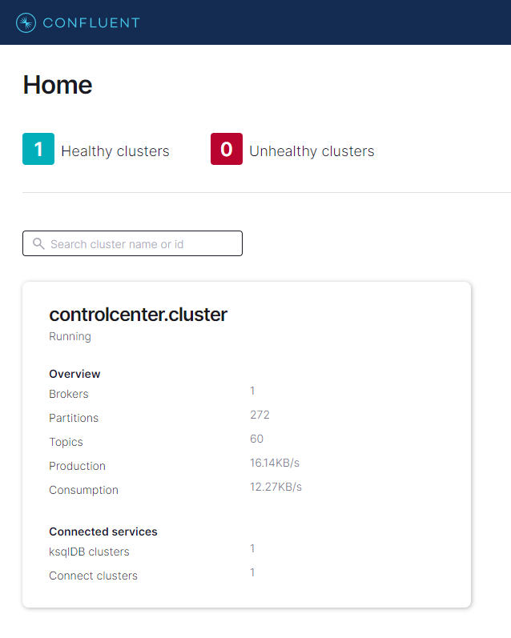
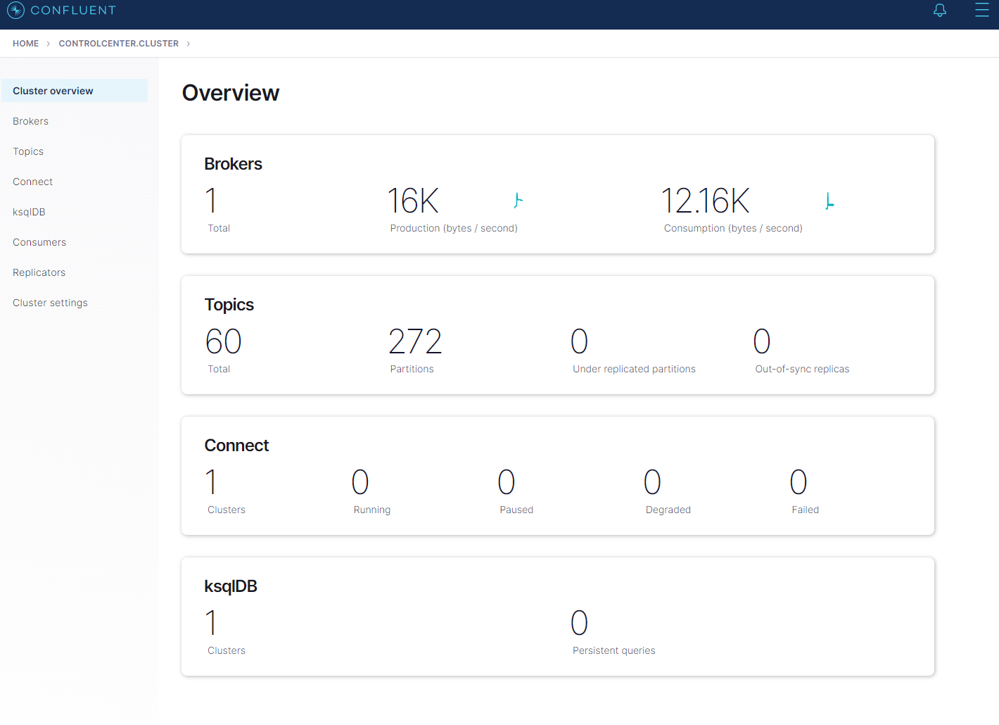
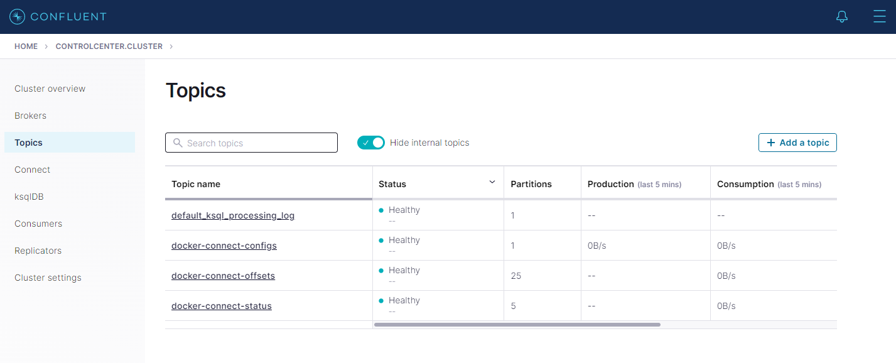

## Configure Development Environment

## Get the docker-compose YAML file using a curl command.

Open a window terminal or Powershell terminal.

create a folder in the terminal

```

 md KafkaScripts


```

Navigate to the folder KafkaScripts.

```
  cd KafkaScripts

```

Run curl command

curl --silent --output docker-compose.yml https://raw.githubusercontent.com/confluentinc/cp-all-in-one/6.2.1-post/cp-all-in-one/docker-compose.yml

List the contents to check the file

```

ls


```

Should see something like this

```
 11/12/2021 11:13 AM           6660 docker-compose.yml

```

Examine the docker-compose.yml file.

```YAML
---
version: '2'
services:
  zookeeper:
    image: confluentinc/cp-zookeeper:6.2.1
    hostname: zookeeper
    container_name: zookeeper
    ports:
      - "2181:2181"
    environment:
      ZOOKEEPER_CLIENT_PORT: 2181
      ZOOKEEPER_TICK_TIME: 2000

  broker:
    image: confluentinc/cp-server:6.2.1
    hostname: broker
    container_name: broker
    depends_on:
      - zookeeper
    ports:
      - "9092:9092"
      - "9101:9101"
    environment:
      KAFKA_BROKER_ID: 1
      KAFKA_ZOOKEEPER_CONNECT: 'zookeeper:2181'
      KAFKA_LISTENER_SECURITY_PROTOCOL_MAP: PLAINTEXT:PLAINTEXT,PLAINTEXT_HOST:PLAINTEXT
      KAFKA_ADVERTISED_LISTENERS: PLAINTEXT://broker:29092,PLAINTEXT_HOST://localhost:9092
      KAFKA_METRIC_REPORTERS: io.confluent.metrics.reporter.ConfluentMetricsReporter
      KAFKA_OFFSETS_TOPIC_REPLICATION_FACTOR: 1
      KAFKA_GROUP_INITIAL_REBALANCE_DELAY_MS: 0
      KAFKA_CONFLUENT_LICENSE_TOPIC_REPLICATION_FACTOR: 1
      KAFKA_CONFLUENT_BALANCER_TOPIC_REPLICATION_FACTOR: 1
      KAFKA_TRANSACTION_STATE_LOG_MIN_ISR: 1
      KAFKA_TRANSACTION_STATE_LOG_REPLICATION_FACTOR: 1
      KAFKA_JMX_PORT: 9101
      KAFKA_JMX_HOSTNAME: localhost
      KAFKA_CONFLUENT_SCHEMA_REGISTRY_URL: http://schema-registry:8081
      CONFLUENT_METRICS_REPORTER_BOOTSTRAP_SERVERS: broker:29092
      CONFLUENT_METRICS_REPORTER_TOPIC_REPLICAS: 1
      CONFLUENT_METRICS_ENABLE: 'true'
      CONFLUENT_SUPPORT_CUSTOMER_ID: 'anonymous'

  schema-registry:
    image: confluentinc/cp-schema-registry:6.2.1
    hostname: schema-registry
    container_name: schema-registry
    depends_on:
      - broker
    ports:
      - "8081:8081"
    environment:
      SCHEMA_REGISTRY_HOST_NAME: schema-registry
      SCHEMA_REGISTRY_KAFKASTORE_BOOTSTRAP_SERVERS: 'broker:29092'
      SCHEMA_REGISTRY_LISTENERS: http://0.0.0.0:8081

  connect:
    image: cnfldemos/cp-server-connect-datagen:0.5.0-6.2.1
    hostname: connect
    container_name: connect
    depends_on:
      - broker
      - schema-registry
    ports:
      - "8083:8083"
    environment:
      CONNECT_BOOTSTRAP_SERVERS: 'broker:29092'
      CONNECT_REST_ADVERTISED_HOST_NAME: connect
      CONNECT_REST_PORT: 8083
      CONNECT_GROUP_ID: compose-connect-group
      CONNECT_CONFIG_STORAGE_TOPIC: docker-connect-configs
      CONNECT_CONFIG_STORAGE_REPLICATION_FACTOR: 1
      CONNECT_OFFSET_FLUSH_INTERVAL_MS: 10000
      CONNECT_OFFSET_STORAGE_TOPIC: docker-connect-offsets
      CONNECT_OFFSET_STORAGE_REPLICATION_FACTOR: 1
      CONNECT_STATUS_STORAGE_TOPIC: docker-connect-status
      CONNECT_STATUS_STORAGE_REPLICATION_FACTOR: 1
      CONNECT_KEY_CONVERTER: org.apache.kafka.connect.storage.StringConverter
      CONNECT_VALUE_CONVERTER: io.confluent.connect.avro.AvroConverter
      CONNECT_VALUE_CONVERTER_SCHEMA_REGISTRY_URL: http://schema-registry:8081
      # CLASSPATH required due to CC-2422
      CLASSPATH: /usr/share/java/monitoring-interceptors/monitoring-interceptors-6.2.1.jar
      CONNECT_PRODUCER_INTERCEPTOR_CLASSES: "io.confluent.monitoring.clients.interceptor.MonitoringProducerInterceptor"
      CONNECT_CONSUMER_INTERCEPTOR_CLASSES: "io.confluent.monitoring.clients.interceptor.MonitoringConsumerInterceptor"
      CONNECT_PLUGIN_PATH: "/usr/share/java,/usr/share/confluent-hub-components"
      CONNECT_LOG4J_LOGGERS: org.apache.zookeeper=ERROR,org.I0Itec.zkclient=ERROR,org.reflections=ERROR

  control-center:
    image: confluentinc/cp-enterprise-control-center:6.2.1
    hostname: control-center
    container_name: control-center
    depends_on:
      - broker
      - schema-registry
      - connect
      - ksqldb-server
    ports:
      - "9021:9021"
    environment:
      CONTROL_CENTER_BOOTSTRAP_SERVERS: 'broker:29092'
      CONTROL_CENTER_CONNECT_CONNECT-DEFAULT_CLUSTER: 'connect:8083'
      CONTROL_CENTER_KSQL_KSQLDB1_URL: "http://ksqldb-server:8088"
      CONTROL_CENTER_KSQL_KSQLDB1_ADVERTISED_URL: "http://localhost:8088"
      CONTROL_CENTER_SCHEMA_REGISTRY_URL: "http://schema-registry:8081"
      CONTROL_CENTER_REPLICATION_FACTOR: 1
      CONTROL_CENTER_INTERNAL_TOPICS_PARTITIONS: 1
      CONTROL_CENTER_MONITORING_INTERCEPTOR_TOPIC_PARTITIONS: 1
      CONFLUENT_METRICS_TOPIC_REPLICATION: 1
      PORT: 9021

  ksqldb-server:
    image: confluentinc/cp-ksqldb-server:6.2.1
    hostname: ksqldb-server
    container_name: ksqldb-server
    depends_on:
      - broker
      - connect
    ports:
      - "8088:8088"
    environment:
      KSQL_CONFIG_DIR: "/etc/ksql"
      KSQL_BOOTSTRAP_SERVERS: "broker:29092"
      KSQL_HOST_NAME: ksqldb-server
      KSQL_LISTENERS: "http://0.0.0.0:8088"
      KSQL_CACHE_MAX_BYTES_BUFFERING: 0
      KSQL_KSQL_SCHEMA_REGISTRY_URL: "http://schema-registry:8081"
      KSQL_PRODUCER_INTERCEPTOR_CLASSES: "io.confluent.monitoring.clients.interceptor.MonitoringProducerInterceptor"
      KSQL_CONSUMER_INTERCEPTOR_CLASSES: "io.confluent.monitoring.clients.interceptor.MonitoringConsumerInterceptor"
      KSQL_KSQL_CONNECT_URL: "http://connect:8083"
      KSQL_KSQL_LOGGING_PROCESSING_TOPIC_REPLICATION_FACTOR: 1
      KSQL_KSQL_LOGGING_PROCESSING_TOPIC_AUTO_CREATE: 'true'
      KSQL_KSQL_LOGGING_PROCESSING_STREAM_AUTO_CREATE: 'true'

  ksqldb-cli:
    image: confluentinc/cp-ksqldb-cli:6.2.1
    container_name: ksqldb-cli
    depends_on:
      - broker
      - connect
      - ksqldb-server
    entrypoint: /bin/sh
    tty: true

  ksql-datagen:
    image: confluentinc/ksqldb-examples:6.2.1
    hostname: ksql-datagen
    container_name: ksql-datagen
    depends_on:
      - ksqldb-server
      - broker
      - schema-registry
      - connect
    command: "bash -c 'echo Waiting for Kafka to be ready... && \
                       cub kafka-ready -b broker:29092 1 40 && \
                       echo Waiting for Confluent Schema Registry to be ready... && \
                       cub sr-ready schema-registry 8081 40 && \
                       echo Waiting a few seconds for topic creation to finish... && \
                       sleep 11 && \
                       tail -f /dev/null'"
    environment:
      KSQL_CONFIG_DIR: "/etc/ksql"
      STREAMS_BOOTSTRAP_SERVERS: broker:29092
      STREAMS_SCHEMA_REGISTRY_HOST: schema-registry
      STREAMS_SCHEMA_REGISTRY_PORT: 8081

  rest-proxy:
    image: confluentinc/cp-kafka-rest:6.2.1
    depends_on:
      - broker
      - schema-registry
    ports:
      - 8085:8085
    hostname: rest-proxy
    container_name: rest-proxy
    environment:
      KAFKA_REST_HOST_NAME: rest-proxy
      KAFKA_REST_BOOTSTRAP_SERVERS: 'broker:29092'
      KAFKA_REST_LISTENERS: "http://0.0.0.0:8085"
      KAFKA_REST_SCHEMA_REGISTRY_URL: 'http://schema-registry:8081'

```

- **Note**: if you have issue with the ports for the proxy change the ports in the yaml to 8085 from 8082 for example

Run the Docker Compose-up command

```

docker-compose up -d

```

## Create a topic in the Kafka cluster

```
http://localhost:9021/clusters
```

Click Topic Cluster Home page



Click Topic from the menu on the left.



Click `+ Add a topic` in the top right hand side of the page.



## .NET Client Installation

confluent-kafka-dotnet is made available via NuGet. It’s a binding to the C client librdkafka, which is provided automatically via the dependent librdkafka.redist package for a number of popular platforms (win-x64, win-x86, debian-x64, rhel-x64 and osx).

To reference confluent-kafka-dotnet and Newtonsoft.Json from within a Visual Studio project, run the following command in the Package Manager Console:

```

PM> Install-Package Confluent.Kafka
PM> Install-Package Newtonsoft.Json -Version 13.0.1

```

## Producer

To create a .NET Producer, first construct an instance of the strongly typed ProducerConfig class, then pass this into the ProducerBuilder’s constructor:

Add this code to your MessageService.cs in the OrderServic project

```C#

using Confluent.Kafka;
using System;
using System.Net;

namespace GrpcOrder.Service.Infrastructure
{
    public class MessageService
    {


        public static int _numProduced = 0;

        public void SendOrderCreatedEvent(string order)
        {
            var topic = "orders";

            var config = new ProducerConfig
            {
                BootstrapServers = "localhost:9092",
                ClientId = Dns.GetHostName(),

            };
            Produce(topic, config, order);

            Console.WriteLine(order);

        }

        public static void Produce(string topic, ClientConfig config, string order)
        {
            using (var producer = new ProducerBuilder<string, string>(config).Build())
            {


                    var key = $"order-messagenum-{_numProduced}";


                    Console.WriteLine($"Producing record: {key} {order}");

                    producer.Produce(topic, new Message<string, string> { Key = key, Value = order },
                        (deliveryReport) =>
                        {
                            if (deliveryReport.Error.Code != ErrorCode.NoError)
                            {
                                Console.WriteLine($"Failed to deliver message: {deliveryReport.Error.Reason}");
                            }
                            else
                            {
                                Console.WriteLine($"Produced message to: {deliveryReport.TopicPartitionOffset}");
                                _numProduced += 1;
                            }
                        });


                producer.Flush(TimeSpan.FromSeconds(10));

                Console.WriteLine($"{_numProduced} messages were produced to topic {topic}");
            }
        }


    }
}

        {

```

## Add a Consume to Console Application

Create a new project and call it PaymentService

Install the following packages in the PaymentService project in the Package Manager Console:

```
PM> Install-Package Confluent.Kafka
PM> Install-Package Newtonsoft.Json -Version 13.0.1
```

Replace the Program.cs file with the following code:

```C#
using System;
using System.Net;
using System.Threading;
using System.Threading.Tasks;
using Confluent.Kafka;
using Newtonsoft.Json.Linq;

namespace PaymentServic
{
    class Program
    {
        static async Task Main(string[] args) {
            Console.WriteLine("Hello World!");
           await CosumeOrdersForPayment();
        }


        //Configure the Kafka consumer and call the Consume method.
        public static async Task CosumeOrdersForPayment()
        {
            var topic = "orders";

            var config = new ConsumerConfig
            {
                BootstrapServers = "localhost:9092",
                ClientId = Dns.GetHostName(),

            };
           await Consume(topic, config);


        }


         static async Task Consume(string topic, ClientConfig config)
        {
            var consumerConfig = new ConsumerConfig(config);
            consumerConfig.GroupId = "dotnet-example-group-1";
            consumerConfig.AutoOffsetReset = AutoOffsetReset.Latest;
            consumerConfig.EnableAutoCommit = true;


            CancellationTokenSource cts = new CancellationTokenSource();
            Console.CancelKeyPress += (_, e) => {
                e.Cancel = true; // prevent the process from terminating.
                cts.Cancel();
            };

            using (var consumer = new ConsumerBuilder<string, string>(consumerConfig).Build())
            {
                consumer.Subscribe(topic);
                var totalCount = 0;
                try
                {
                    while (true)
                    {
                        var cr = consumer.Consume(cts.Token);
                        totalCount += 1; //JObject.Parse(cr.Message.Value.ToString()).Value<int>("count");
                        Console.WriteLine($"Consumed record with key {cr.Message.Key} and value {cr.Message.Value}, and updated total count to {totalCount}");


                    }
                }
                catch (OperationCanceledException)
                {
                    // Ctrl-C was pressed.
                }
                finally
                {
                    consumer.Close();
                }
            }
        }
    }


}


```

```

```
