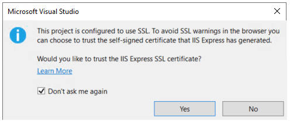

## This tutorial teaches the basics of building a web API with ASP.NET Core.

In this tutorial, you learn how to:

- Create a web API project.
- Add a model class and a database context.
- Scaffold a controller
- Call the web API with Swagger.


At the end, you have a web API that can manage "to-do" items stored in a database.

- From the File menu, select New > Project.
- Enter Web API in the search box.
- Select the ASP.NET Core Web API template and select Next.
- In the Configure your new project dialog, name the project ApiGateway and select Next.
- In the Additional information dialog, confirm that Framework is .NET 6.0 (Long-term support), and select Create.

The project template creates a WeatherForecast API with support for Swagger.

Press Ctrl+F5 to run without the debugger.

Visual Studio displays the following dialog
when a project is not yet configured to use SSL:



Select **Yes** if you trust the IIS Express SSL certificate.

The following dialog is displayed:


Select **Yes** if you agree to trust the development certificate.

Visual Studio launches the default browser and navigates to `https://localhost:<port>/swagger/index.html`, where `<port>` is a randomly chosen port number.

The Swagger page `/swagger/index.html` is displayed. Select **GET** > **Try it out** > **Execute**. The page displays:

- The [Curl](https://curl.haxx.se/) command to test the WeatherForecast API.
- The URL to test the WeatherForecast API.
- The response code, body, and headers.
- A drop down list box with media types and the example value and schema.

If the Swagger page doesn't appear, see this [GitHub issue](https://github.com/dotnet/AspNetCore.Docs/issues/21647).

Swagger is used to generate useful documentation and help pages for web APIs. This tutorial focuses on creating a web API. For more information on Swagger, see [ASP.NET Core web API documentation with Swagger / OpenAPI](https://docs.microsoft.com/en-us/aspnet/core/tutorials/web-api-help-pages-using-swagger?view=aspnetcore-6.0).

Copy and paste the **Request URL** in the browser: https://localhost:<port>/WeatherForecast

JSON similar to the following example is returned:

```JSON
[
    {
        "date": "2019-07-16T19:04:05.7257911-06:00",
        "temperatureC": 52,
        "temperatureF": 125,
        "summary": "Mild"
    },
    {
        "date": "2019-07-17T19:04:05.7258461-06:00",
        "temperatureC": 36,
        "temperatureF": 96,
        "summary": "Warm"
    },
    {
        "date": "2019-07-18T19:04:05.7258467-06:00",
        "temperatureC": 39,
        "temperatureF": 102,
        "summary": "Cool"
    },
    {
        "date": "2019-07-19T19:04:05.7258471-06:00",
        "temperatureC": 10,
        "temperatureF": 49,
        "summary": "Bracing"
    },
    {
        "date": "2019-07-20T19:04:05.7258474-06:00",
        "temperatureC": -1,
        "temperatureF": 31,
        "summary": "Chilly"
    }
]


```

## Update the launchUrl

In Properties\launchSettings.json, update `launchUrl` from `"swagger"` to `"api/todoitems"`:

## Add a model class

A model is a set of classes that represent the data that the app manages. The model for this app is a single Order class.

- In Solution Explorer, right-click the project. Select Add > New Folder. Name the folder Models.

- Right-click the Models folder and select Add > Class. Name the Proto Order and select Add.

- Replace the template code with the following:

```C#
namespace ApiGateway.Models
{
    public class OrderRequest
    {
        public long CustomerId { get; set; }
        public long OrderId { get; set; }
        public long PaymentId { get; set; }
        public double total { get; set; }
        public List<string> Items { get; set; }
    }
}


```

- In Solution Explorer, right-click the project. Select Add > New Folder. Name the folder Protos.

- Create a orderPackage Order.proto then copy and past the below code in the file.

```C#

syntax = "proto3";

option csharp_namespace = "ApiGateway";

package orderPackage;

service orderPackage {
    rpc CreateOrder(Order) returns (StatusMessage);
}

message Order {
    int64 customerId = 1;
    int64 orderId = 2;
    int64 paymentId = 3;
    double total = 4;
    repeated string orderItems = 5;
}

message StatusMessage {
    string message = 1;
    bool orderReceived = 2;
}
```

Next we will add the gRPC Client to process the order

## Install packages for gRPC Client

```
        dotnet add ApiGateway.csproj package Grpc.Net.Client
        dotnet add ApiGateway.csproj package Google.Protobuf
        dotnet add ApiGateway.csproj package Grpc.Tools
```

- Edit the ApiGateway.csproj project file:

Right-click the project and select **Edit Project File**.

- Add an item group with a `<Protobuf>` element that refers to the order.proto file:

```xml

    <ItemGroup>
       <Protobuf Include="Protos\order.proto" GrpcServices="Client" />
    </ItemGroup>
```

## Create the Orders client

Build the client project to create the types in the `ApiGateway` namespace. The `Order` types are generated automatically by the build process.

Update the gRPC client OrdersController.cs file with the following code:

```C#

using System;
using System.Collections.Generic;
using System.Linq;
using System.Threading.Tasks;
using Microsoft.AspNetCore.Mvc;
using Microsoft.Extensions.Logging;
using ApiGateway.Models;
using Grpc.Net.Client;


namespace ApiGateway.Controllers
{
    [ApiController]
    [Route("[controller]")]
    public class OrderController : ControllerBase
    {


        private readonly ILogger<OrderController> _logger;

        public OrderController(ILogger<OrderController> logger)
        {
            _logger = logger;
        }

        [HttpPost]
        public async Task<ActionResult> Create( object order)
        {
            /// calls Grpc Service to create order
            ///
            ///
         using var channel = GrpcChannel.ForAddress("https://localhost:5001");
         var client = new orderPackage.orderPackageClient(channel);


        var orders = new Order();
        orders.OrderId = 1;
        orders.CustomerId = 1;
        orders.PaymentId = 1;
        orders.OrderItems.Add(new [] {});
        orders.Total = 0;


        var reply = await client.CreateOrderAsync(
         "{productId = 1, price = 3.44}","{productId = 2, price = 5.44}"                     orders);
          //  Console.WriteLine("Order response: " + reply.Message);
          await Task.Run(() => {Console.WriteLine($"Order Created: {order}");});
           return Ok();
        }
    }
}


```

OrdersController contains the entry point and logic for the gRPC client.

The Orders client is created by:

Instantiating a GrpcChannel containing the information for creating the connection to the gRPC service.
Using the GrpcChannel to construct the Greeter client:

We need to update the launchSettings.json to avoid port conflict when running the api and the Grpc Server together on or local dev environment.

Change the ports from 5001 to 5002 and 5000 to 5003

Open the Properties folder and then open the launchSettings.json file.

```Json

{
  "$schema": "http://json.schemastore.org/launchsettings.json",
  "iisSettings": {
    "windowsAuthentication": false,
    "anonymousAuthentication": true,
    "iisExpress": {
      "applicationUrl": "http://localhost:11937",
      "sslPort": 44361
    }
  },
  "profiles": {
    "IIS Express": {
      "commandName": "IISExpress",
      "launchBrowser": true,
      "launchUrl": "swagger",
      "environmentVariables": {
        "ASPNETCORE_ENVIRONMENT": "Development"
      }
    },
    "ApiGateway": {
      "commandName": "Project",
      "dotnetRunMessages": "true",
      "launchBrowser": true,
      "launchUrl": "swagger",
      "applicationUrl": "https://localhost:5002;http://localhost:5003",
      "environmentVariables": {
        "ASPNETCORE_ENVIRONMENT": "Development"
      }
    }
  }
}

```
