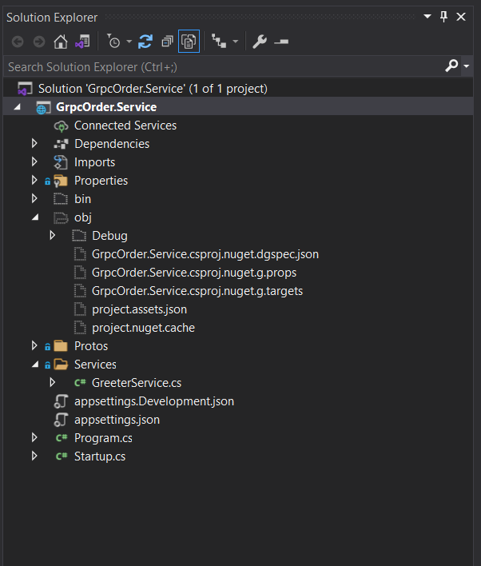

Create a gRPC server in ASP.NET Core

This tutorial shows how to create a .NET Core gRPC client and an ASP.NET Core gRPC Server.

At the end, you'll have a gRPC gRPC Order service.

In this tutorial, you:

Create a gRPC Server.
Test the gRPC client service

Create a gRPC service

- Start Visual Studio and select Create a new project.
- In the Create a new project dialog, select gRPC Service and select Next.
- In the **Configure your new project** dialog, enter GrpcOrder.Service for **Project name**. It's important to name the project GrpcOrder.Service.
- Select Next.
- In the **Additional information** dialog, select **.NET 5.0** in the **Target Framework** dropdown.
- Select **Create**.

## Create a Order Proto

- In Solution Explorer, right-click the Proto Folder. Select Add new Item and search for proto then create a `order.proto`.

Copy the below code into the

```C#

syntax = "proto3";

option csharp_namespace = "GrpcOrder.Service.Protos";


package orderPackage;

service orderPackage {
    rpc CreateOrder(Order) returns (StatusMessage);
}

message Order {
    int64 customerId = 1;
    int64 orderId = 2;
    int64 paymentId = 3;
    double total = 4;
    repeated string orderItems = 5;
}

message StatusMessage {
    string message = 1;
    bool orderReceived = 2;
}


```

- Add the order.proto to the project file open the GrpcOrder.Service project file by double clicking.

Add the below code to project file:

```XML

<Project Sdk="Microsoft.NET.Sdk.Web">

  <PropertyGroup>
    <TargetFramework>net5.0</TargetFramework>
  </PropertyGroup>

  <ItemGroup>
    <Protobuf Include="Protos\greet.proto" GrpcServices="Server" />
	<Protobuf Include="Protos\order.proto" GrpcServices="Server" />
  </ItemGroup>

  <ItemGroup>
    <PackageReference Include="Grpc.AspNetCore" Version="2.34.0" />
  </ItemGroup>

</Project>


```

## Build the Project to generate the proto conponents

Build the project the this will auto generate some code lets examine what was created.

In the solution explore click show all files


Open **obj** folder > **Debug** > **net5**.0 > **Protos** will see that the gRPC framework generated to files `Order.cs` and `OrderGrpc.cs`.

Open the files and examine the contents.

## Implement the Order Service to process the order

Right click the Services folder in the project and select Add > Class name the class OrderService.cs.

Add the following code to the OrderService.cs.

```C#

using Grpc.Core;
using GrpcOrder.Service.Infrastructure;
using GrpcOrder.Service.Protos;
using Microsoft.Extensions.Logging;
using System.Threading.Tasks;
using static GrpcOrder.Service.Protos.orderPackage;

namespace GrpcOrder.Service.Services
{
    public class OrderService : orderPackageBase
    {

        private readonly ILogger<OrderService> _logger;
        private MessageService _messageService;

        public OrderService(ILogger<OrderService> logger, MessageService messageService)
        {
            _logger = logger;
            _messageService = messageService;
        }

        public override  Task<StatusMessage> CreateOrder(Order request, ServerCallContext context)
        {

            var orderCreatedEventMessage = $"Order Creted: {request.OrderId} Payment Account ID: {request.PaymentId}";
            _messageService.SendOrderCreatedEvent(orderCreatedEventMessage);
            return Task.FromResult(new StatusMessage
            {
                Message = "Order Created: " + request.OrderId + request.PaymentId


        });

        }


    }
}

```

## Create a MessageService Class

Next we Create the MessageService for Producing our Order created event on Kafka Stream. We will implement the Kafka later for now this will be a place holder.

Right Click on the project and select **Add** > **New Folder** name the folder `Infrastructure`.

Right click the `Infrastructure` folder and select **Add** > **Class** name the class MessageService.cs and click .

Copy and paste the code below

```C#

using System;
using System.Collections.Generic;
using System.Linq;
using System.Threading.Tasks;

namespace GrpcOrder.Service.Infrastructure
{
    public class MessageService
    {

        public async Task SendOrderCreatedEvent(string order)
        {

            Console.WriteLine(order);

        }


    }
}


```

Build and Debug the app.

## Add Kafka Producer to the MessageService

Install Nuget packages:

```

PM> Install-Package Confluent.Kafka
PM> Install-Package Newtonsoft.Json -Version 13.0.1

```


Relace the code in the MessageService.cs with the following code.

```C#

 public static int _numProduced = 0;

        public void SendOrderCreatedEvent(string order)
        {
            var topic = "orders";

            var config = new ProducerConfig
            {
                BootstrapServers = "localhost:9092",
                ClientId = Dns.GetHostName(),

            };
            Produce(topic, config, order);

            Console.WriteLine(order);

        }

        public static void Produce(string topic, ClientConfig config, string order)
        {

            // Create the producer
            using (var producer = new ProducerBuilder<string, string>(config).Build())
            {


                    var key = $"order-messagenum-{_numProduced}";


                    Console.WriteLine($"Producing record: {key} {order}");


                    // Produce record directly to the topic
                    producer.Produce(topic, new Message<string, string> { Key = key, Value = order },
                        (deliveryReport) =>
                        {
                            if (deliveryReport.Error.Code != ErrorCode.NoError)
                            {
                                Console.WriteLine($"Failed to deliver message: {deliveryReport.Error.Reason}");
                            }
                            else
                            {
                                Console.WriteLine($"Produced message to: {deliveryReport.TopicPartitionOffset}");
                                _numProduced += 1;
                            }
                        });

                // Flush the producer to make sure all messages have been written
                producer.Flush(TimeSpan.FromSeconds(10));

                Console.WriteLine($"{_numProduced} messages were produced to topic {topic}");
            }
        }


```
